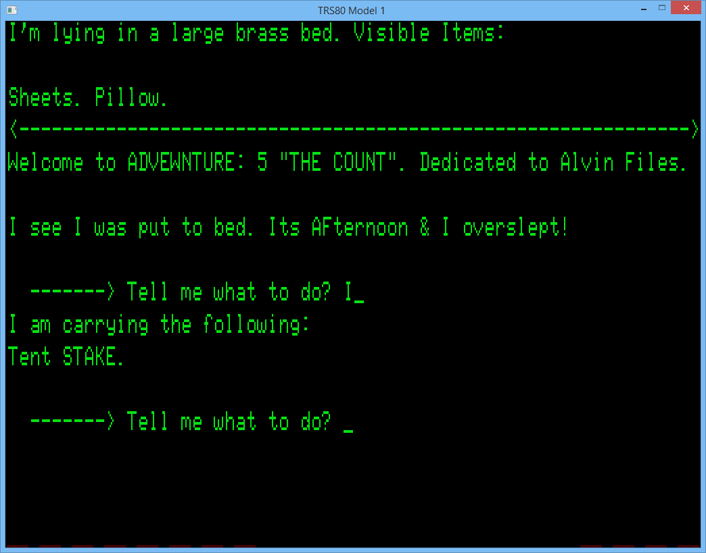

# Scott19 - Scott Adams Interpreter for the TRS-80!

## Build Dependencies

To compile, you'll need `gcc` to compile `dat2c` which converts `.dat` files into `c` stuctures.

For the TRS-80 binaries, you'll need the Small Device C Compiler (SDCC), which is free and open source, http://sdcc.sourceforge.net

## Building

Edit `src/makefile` and change `SDCCDIR` to be the location where you have SDCC installed.

Then (eg)
`make adv05`

Will build `adv05.dsk`, `adv05.cmd` and `adv05.cas`

## Running on emulators:

Example, to run on model I, under DOS

`..\emu\sdltrs -model 1 -romfile ..\emu\model1.rom -scale 2 -disk0 ..\emu\newdos80.dsk -disk1 adv05.dsk -foreground 0x07e214`

Example, to run on model III, under DOS

`..\emu\sdltrs -model 3 -romfile3 ../emu/model3.rom -scale 2 -disk0 "../emu/ld3-531.dsk" -disk1 adv05.dsk -foreground 0x07e214`

