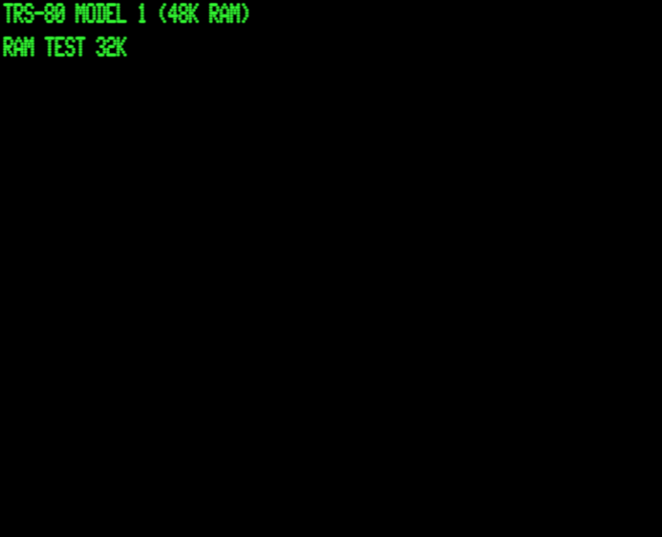

# Scott19 - Scott Adams Interpreter for the TRS-80!



It's based on `scottfree` ported to the TRS-80 and changed a bit to look more like the originals.

## Build Dependencies

To compile, you'll need `gcc` to compile `dat2c` which converts `.dat` files into `c` stuctures.

For the TRS-80 binaries, you'll need the Small Device C Compiler (SDCC), which is free and open source, http://sdcc.sourceforge.net

## Building

Edit `src/makefile` and change `SDCCDIR` to be the location where you have SDCC installed.

Then (eg)
```
make clean
make adv05.dsk
```


Will build `adv05.dsk`, `adv05.cmd` and `adv05.cas`


## Running

Runs under Model I, III, 4/4P.

### Emulators

Example, to run on model I, under DOS

`..\emu\trs80gp -m1 -50 -ld -d1 adv05.dsk`

OR

`..\emu\sdltrs -model 1 -romfile ..\emu\model1.rom -scale 2 -disk0 ..\emu\newdos80.dsk -disk1 adv05.dsk -foreground 0x07e214`

Example, to run on model III, under DOS

`..\emu\sdltrs -model 3 -romfile3 ../emu/model3.rom -scale 2 -disk0 "../emu/ld3-531.dsk" -disk1 adv05.dsk -foreground 0x07e214`

## Ghostking

Run from `src` directory with (windows)

`godos2 prebuilt\gking`

or as command:

`..\emu\trs80gp -m1 -50 -ld -d1 prebuilt/gking.dsk`


